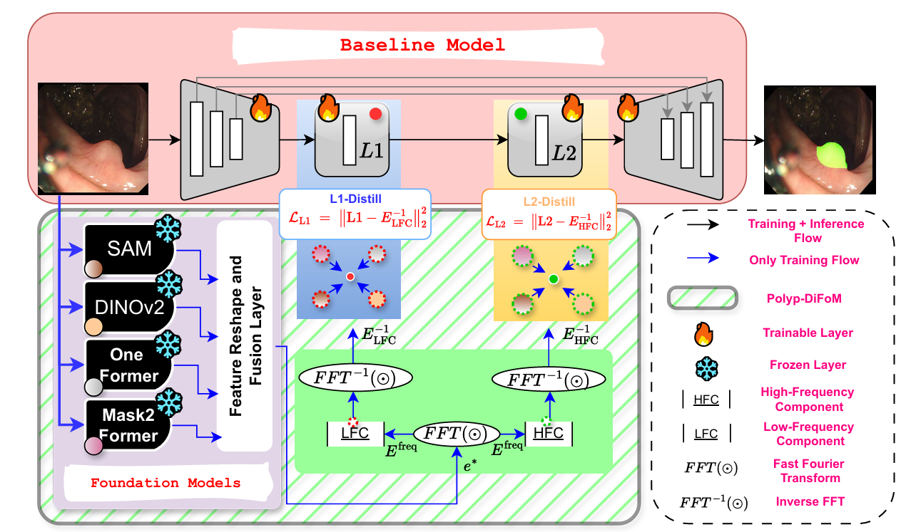
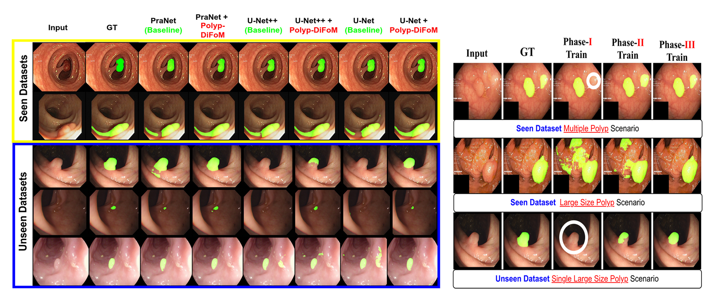

# From SAM to DINOv2: Towards Distilling Foundation Models to Lightweight Baselines for Generalized Polyp Segmentation

**Authors:**  
Shivanshu Agnihotri, Snehashis Majhi, Deepak Ranjan Nayak and Debesh Jha


## Framework Overview
Our framework integrates frozen foundation models (SAM, DINOv2, OneFormer and Mask2Former) into a lightweight segmentation baselines using a staged distillation strategy.

<p align="center">
  
</p>

## Qualitative Results
Comparison of our method with state-of-the-art approaches on multiple polyp segmentation datasets.

<p align="center">
  
</p>

## Method
-  Modular distillation that injects rich priors from multiple vision foundation models (SAM, DINOv2, CLIP, OneFormer, Mask2Former) into lightweight baselines (UNet/U-Net++).
-  Low- and high-frequency features are distilled into bottleneck layers.
-  A 3 phased training strategy ensures stable convergence.


### Dataset Preparation
Download the polyp datasets and organize them as follows:
data/
├── TrainDB/ 
│ ├── images/
│ └── masks/
├── TestDB/
│ ├── CVC-300/
│ ├── CVC-ClinicDB/
│ ├── CVC-ColonDB/
│ ├── ETIS-LaribPolypDB/
│ └── Kvasir/

## Pre-trained Weights

We provide multiple pre-trained weight files corresponding to different configurations.  
The naming convention reflects which foundation models are used during training.

- **`unet_sam_dino_best.pth`**  
  Trained with **two foundation models**:
  - SAM
  - DINO  
  This model integrates features from SAM and DINO into the U-Net architecture.

- **`emcadnet_sam_dinov3_oneformer_3f.pth`**  
  Trained using **three integrated foundation models (3F setting)**:
  - SAM
  - DINOv3
  - OneFormer  

- **`pranet_sam_dino_oneformer_mask2.pth`**  
  Trained with **all integrated foundation models**:
  - SAM
  - DINO
  - OneFormer
  - Mask2Former

  This model represents the **full configuration** and can be used to evaluate the overall performance of PolypDiFoM over PraNet.

### 📥 Download Links

All pre-trained weights can be downloaded from Google Drive:

- [Download all model weights](https://drive.google.com/drive/folders/1yz92j-Ap2gkCvIPMBnxBldH7zvIV0UY4?usp=sharing)


## Citation
If you find this work useful, please cite:

```bibtex
@article{agnihotri2025sam,
  title={From SAM to DINOv2: Towards Distilling Foundation Models to Lightweight Baselines for Generalized Polyp Segmentation},
  author={Agnihotri, Shivanshu and Majhi, Snehashis and Nayak, Deepak Ranjan and Jha, Debesh},
  journal={arXiv preprint arXiv:2512.09307},
  year={2025}
}
```

### License
This project is for research and educational purposes only.
Commercial use requires permission.


